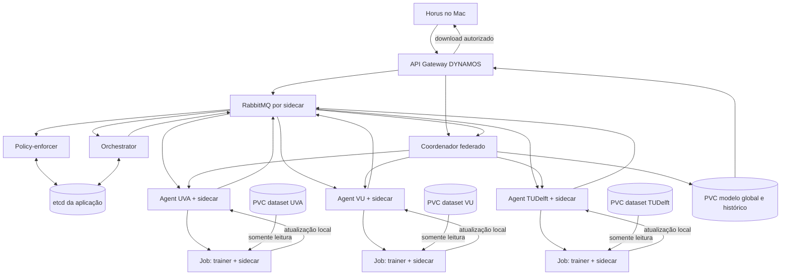

# DYNAMOS e Treinamento Federado
## Guia de arquitetura, componentes, operação e testes

**Finalidade:** permitir que uma nova pessoa entenda o projeto, a integração de treinamento federado, como executar o sandbox local e como verificar ou reverter as mudanças.

**Estado descrito:** protótipo local com dados sintéticos, validado no cluster `kind-dynamos-training`. O cluster original `kind-dynamos` não foi atualizado pela integração.

> Este material descreve um sandbox educacional. Não use dados pessoais, clínicos, confidenciais ou de organizações reais. Leia os limites de segurança antes de adaptar o protótipo.

## 1. Resumo Executivo

DYNAMOS é uma plataforma de troca de dados baseada em serviços, Kubernetes, RabbitMQ e etcd. A API recebe um pedido; o policy-enforcer confere acordos; o orchestrator identifica agentes autorizados e organiza a execução; cada agente trabalha no contexto da sua organização.

A extensão acrescenta um fluxo de aprendizado federado. Horus solicita um treinamento por meio da API Gateway original. DYNAMOS autoriza os participantes. Agentes UVA, VU e TUDelft iniciam Jobs locais com um contêiner `trainer` e o sidecar DYNAMOS. Os trainers leem volumes sintéticos locais em modo somente leitura. Atualizações do modelo retornam por gRPC, sidecar e RabbitMQ; o coordenador aplica FedAvg e guarda o modelo global. A API só libera o download final após verificar novamente a autorização.

O resultado do protótipo é um modelo global de regressão logística, não três modelos individuais. Os registros brutos dos datasets não são enviados pelo trainer. Os pesos e as métricas locais saem das organizações; isso não oferece, por si só, privacidade diferencial ou agregação segura.

## 2. Conceitos Importantes

| Termo | O que significa neste projeto |
|---|---|
| Organização ou data steward | Participante do exemplo: UVA, VU ou TUDelft. Cada um tem namespace e PVC próprios no cluster de teste. |
| Arquétipo | Forma de organizar a execução. `computeToData` leva o processamento aos dados. Para ML local, `dataThroughTtp` não é aceito. |
| Orchestrator | Serviço que confere agentes disponíveis e distribui a composição autorizada. Não treina nem cria diretamente o Job. |
| Agent | Serviço permanente dentro do namespace da organização. Registra a organização, recebe composições e cria Jobs Kubernetes locais. |
| Sidecar DYNAMOS | Contêiner auxiliar no mesmo Pod; oferece gRPC e faz a ponte com RabbitMQ. Não é o trainer nem uma fronteira física de segurança. |
| Job efêmero | Trabalho Kubernetes que executa uma rodada e termina. O TTL apaga Jobs concluídos depois de aproximadamente 600 segundos. |
| Federação | Em cada rodada, o coordenador envia os pesos globais; cada organização treina localmente e retorna uma atualização; FedAvg combina as atualizações. |

## 3. O Que É etcd

etcd é um armazenamento distribuído de chave e valor. Ele oferece a vários serviços uma fonte comum de configuração e estado. Em um cluster de três membros, seus nós replicam o estado por consenso Raft; dois membros disponíveis formam a maioria necessária para continuar operações.

Há **dois etcd diferentes** no ambiente Kubernetes:

| Instância | Local no cluster de teste | O que guarda |
|---|---|---|
| etcd da aplicação DYNAMOS | Namespace `core`, Pods `etcd-0`, `etcd-1`, `etcd-2` | Acordos, arquétipos, request types, metadados, agentes online, composições e autorizações DYNAMOS. |
| etcd interno do Kubernetes | Namespace `kube-system`, normalmente um Pod do control plane | Estado do Kubernetes: Deployments, Pods, Secrets, PVCs, Jobs e outros recursos. |

Chaves úteis da aplicação:

| Prefixo | Exemplo de informação |
|---|---|
| `/policyEnforcer/agreements/UVA` | Relações entre usuário, datasets, tipos de pedido, algoritmos e arquétipos permitidos. |
| `/archetypes/computeToData` | Configuração do local/forma de execução. |
| `/requestTypes/mlTrainingRequest` | Tipo de pedido de treinamento reconhecido por DYNAMOS. |
| `/microservices/ml-trainer/chainMetadata` | Metadados do trainer na composição. |
| `/agents/online/UVA` | Registro temporário, com lease, que indica se o agente está online. |
| `/agents/jobs/UVA/...` | Composição registrada para uma execução local. |
| `/training/approvals/{run_id}` | Plano de treinamento aprovado e vinculado à identidade do sandbox. |

**etcd não é o armazenamento dos CSVs nem do artefato final.** Datasets ficam nos PVCs `training-data`, um por organização. O estado da execução e o modelo final ficam no PVC `training-state` do coordenador. O etcd contém metadados e estado de coordenação, não os dados de treino.

## 4. Arquitetura Implantada no Sandbox

O protótipo usa um cluster `kind` separado chamado `kind-dynamos-training`, com Cilium para aplicar NetworkPolicies. O cluster `kind-dynamos` é o ambiente DYNAMOS original e não deve ser substituído nos comandos.



### Namespaces e Pods

| Namespace | Principais recursos |
|---|---|
| `training-system` | API Gateway DYNAMOS + sidecar; policy-enforcer + sidecar; orchestrator + sidecar; coordenador federado; configuração e Secrets do sandbox. |
| `core` | RabbitMQ, três membros do etcd da aplicação e PVC de RabbitMQ. |
| `uva` | Agent Go + sidecar; PVC `training-data`; PVC `training-state`; Jobs locais. |
| `vu` | Agent Go + sidecar; PVC `training-data`; PVC `training-state`; Jobs locais. |
| `tudelft` | Agent Go + sidecar; PVC `training-data`; PVC `training-state`; Jobs locais. |
| `kube-system` | Control plane Kubernetes, etcd interno, Cilium e DNS. |

Cada organização tem um volume distinto. Isso demonstra isolamento de workload e rede dentro do sandbox, mas as três organizações ainda compartilham o mesmo cluster e o mesmo computador. Não equivale a três organizações com infraestrutura física ou administrativa independente.

## 5. Responsabilidade de Cada Componente

| Componente | Responsabilidade | O que não faz |
|---|---|---|
| Horus (`horus-sandbox-frontend`) | Interface para selecionar UVA/VU/TUDelft, algoritmo aprovado, rodadas e épocas; mostra progresso e permite baixar o modelo global concluído. | Não fala com o socket Docker, não escolhe um caminho de arquivo arbitrário, não envia scripts Python e não treina. |
| API Gateway DYNAMOS | Recebe `mlTrainingRequest`, autentica o usuário fixo do sandbox, inicia aprovação, persiste o plano, encaminha para o coordenador e protege histórico/download. | Não decide sozinha que uma organização permitiu o uso dos seus dados. |
| Policy-enforcer | Compara pedido com acordos no etcd: usuário, dataset, algoritmo e `computeToData`. Exige aprovação integral dos participantes selecionados. | Não executa consulta nem cria Pods. |
| Orchestrator | Confirma disponibilidade dos agentes via etcd, valida aprovação completa, seleciona `computeToData` e publica a composição. Nas revalidações, volta a conferir sem criar outra composição. | Não executa o trainer e não lê os datasets. |
| Agent de cada organização | Registra agente com lease; guarda a composição; cria Job no namespace local; recebe e valida resultado local. | Não agrega as atualizações das outras organizações. |
| Sidecar DYNAMOS | Expõe gRPC local e transporta mensagens entre serviço e RabbitMQ; carrega mensagens de resultado de volta ao agente. | Não é o sidecar de observabilidade do Linkerd e não monitora a qualidade do treinamento. |
| RabbitMQ | Roteia mensagens de autorização, composição, resultado e comunicação de microserviços. | Não é o armazenamento permanente do modelo nem dos datasets. |
| etcd da aplicação | Distribui configuração e registros entre serviços DYNAMOS e guarda autorizações/composições. | Não guarda os CSVs nem o modelo final. |
| Coordenador federado | Conduz as rodadas, revalida a política, recolhe resultados, calcula FedAvg e persiste o modelo global. | Não monta nem recebe o CSV de cada organização. |
| Trainer | No Job local, lê `/data/dataset.csv` em somente leitura, ajusta o modelo local e envia uma atualização validada via gRPC ao sidecar. | Não recebe token administrativo do Kubernetes ou do coordenador. |
| Cilium/NetworkPolicy | Restringe conexões de rede entre workers, agentes e coordenador no cluster de teste. | Não verifica semântica SQL/ML, não substitui autorização e não protege contra administradores do nó. |

## 6. Fluxo de Uma Execução

1. A pessoa seleciona no Horus organizações e parâmetros aprovados e inicia o treinamento.
2. O navegador envia o pedido para a API Gateway DYNAMOS via proxy local do Vite. O token local identifica `sandbox-researcher`; o navegador não escolhe outra identidade.
3. A API converte o pedido para `mlTrainingRequest` e o envia pela API gRPC do sidecar/RabbitMQ.
4. O policy-enforcer consulta `/policyEnforcer/agreements/{organização}` no etcd. Uma organização sem permissão faz o pedido completo falhar antes da criação de Job.
5. O orchestrator localiza `/agents/online/{organização}`, confirma todas as organizações e escolhe `computeToData`. Composição é publicada para cada agente por RabbitMQ.
6. Os agentes persistem a composição em `/agents/jobs/...`. A API salva a autorização em `/training/approvals/{run_id}` e assina um capability HMAC vinculado a usuário, organizações e parâmetros.
7. O coordenador valida a assinatura. Antes de cada rodada, pede nova autorização pela API Gateway e pelo fluxo DYNAMOS.
8. Para cada organização, o coordenador chama o agente Go local. O agente verifica capability, organização e composição e cria um Job Kubernetes no próprio namespace.
9. Cada Job contém `trainer` e `sidecar`. O trainer monta somente seu PVC `training-data` em `/data` como somente leitura. Não recebe token de ServiceAccount.
10. O trainer ajusta regressão logística local. Sua mensagem tipada vai por gRPC local ao sidecar, e o sidecar envia a atualização pela fila RabbitMQ da organização.
11. O Agent valida formato, valores, identificador da rodada e capability de uso único. O coordenador recolhe as atualizações e aplica FedAvg ponderado pelo número de amostras de treino.
12. As rodadas se repetem. Antes de exportar, há outra validação DYNAMOS. Após conclusão, apenas `model.json` global é exposto para download.

Cancelamento exclui os Jobs rastreados. Uma revogação é observada em pontos de revalidação e antes do download; não há garantia de preempção instantânea ou atomicidade entre serviços.

## 7. Algoritmo e Dados do Protótipo

- Algoritmo disponível: `logistic-regression-v1`, baseado em scikit-learn `SGDClassifier` com perda logística.
- Agregação: FedAvg ponderado pela quantidade de exemplos de treino de cada organização.
- Dataset: `synthetic-local-v1`; 240 exemplos por organização, quatro features numéricas e um rótulo binário.
- Os três CSVs usam o mesmo esquema e sementes aleatórias diferentes.
- Padrão: três rodadas federadas, duas épocas locais por rodada.
- A tabela Horus mostra acurácia e loss de validação local da última rodada. Essas métricas **não** avaliam o modelo global em um conjunto de teste independente.
- O download é um JSON portátil com coeficientes, intercepto, features, classes e metadados; não é pickle/joblib. Não há endpoint de download de dataset ou modelo local.

Manter registros brutos locais não elimina vazamento via pesos ou métricas. Não há secure aggregation nem differential privacy. O protótipo serve para validar fluxo e infraestrutura, não para alegar privacidade formal.

## 8. Pastas e Arquivos-Chave

| Caminho | Conteúdo |
|---|---|
| `go/cmd/api-gateway/training.go` | Rotas ML, autenticação do sandbox, aprovação DYNAMOS, armazenamento do grant, revalidação e download. |
| `go/cmd/policy-enforcer/generate_validation_response.go` | Validação por acordo e permissões do tipo ML. |
| `go/cmd/orchestrator/training.go` | Aprovação integral e requisito do arquétipo local. |
| `go/cmd/orchestrator/composition_request.go` | Seleção de arquétipo e publicação de composição aos agentes. |
| `go/cmd/orchestrator/manage_jobs.go` | Tratamento de aprovação e fluxo de composição. |
| `go/cmd/agent/training.go` | Registro online, API local de rodadas, criação/controle de Job e validação de resultado. |
| `go/cmd/agent/consume.go` | Recebe composição ML e a registra no etcd sem executar o caminho SQL. |
| `go/cmd/agent/incoming_microservice_communication.go` | Roteia resultado ML recebido via sidecar. |
| `go/cmd/sidecar/rabbit_send.go` | Transporte de mensagens para RabbitMQ. |
| `go/cmd/sidecar/rabbit_ms_chain.go` | Recebe mensagens e controla o sidecar de Jobs temporários. |
| `go/pkg/training/` | Contrato permitido, validação do pedido e assinatura/verificação HMAC. |
| `python/federated-training/model.py` | Dataset sintético, treino local, FedAvg e exportação. |
| `python/federated-training/service.py` | Coordenador, agente HTTP, API do sandbox e processo trainer. |
| `python/federated-training/integration.py` | Valida grant no coordenador e envia resultado via sidecar/gRPC. |
| `proto-files/rabbitMQ.proto` | Mensagens DYNAMOS estendidas com metadados ML. Código Go gRPC fica em `go/pkg/proto/`. |
| `charts/federated-training/` | Recursos do cluster de teste: organizações, coordenador, DYNAMOS, RabbitMQ, etcd, volumes e políticas. |
| `configuration/federated-training/manage.py` | Build local, instalação no contexto separado, port-forward e estado. |
| `configuration/federated-training/verify.py` | Testes ativos de volumes, RBAC e NetworkPolicies. |
| `configuration/federated-training/test_integrated.py` | Testes integrados de autorização, treinamento, revogação e transporte. |
| `configuration/federated-training/integration_rollback.py` | Reversão protegida por hashes, do código integrado ao protótipo anterior. |
| `horus-sandbox-frontend/src/pages/FederatedTraining.tsx` | Interface conectada ao endpoint ML da API Gateway. |
| `horus-sandbox-frontend/vite.config.ts` | Proxy local da interface para API Gateway; token não vai para o bundle do browser. |

## 9. Preparar e Executar no macOS

### Pré-requisitos

- Docker Desktop ativo e contêiner de desenvolvimento `dynamos-dev` disponível.
- Instalação inicial do sandbox já concluída. A primeira instalação cria `kind-dynamos-training`, instala Cilium, constrói imagens locais e aplica charts. Pode levar alguns minutos.
- Os comandos são executados na raiz do repositório, salvo quando indicados como executados dentro de `dynamos-dev`.
- Neste Mac, o alias `docker` aponta para Podman em alguns terminais. O script usa diretamente o binário do Docker Desktop.

### Primeira instalação ou atualização

```bash
python3 configuration/federated-training/manage.py setup
```

O script guarda token/chave local em `configuration/federated-training/.local/` com permissões restritas e ignorado pelo Git; constrói imagens para arquitetura local; carrega-as no cluster `dynamos-training`; instala Cilium e o chart integrado; cria ou reusa datasets; aguarda serviços; testa isolamento; só então habilita treinamento. Ele restaura o contexto kubectl anterior e não faz push de imagens.

**Não rode `setup` durante um treino ativo.** Os Jobs de seed não devem ser recriados sobre PVCs preenchidos; o script os espera, sem sobrescrever o arquivo já existente.

### Uso normal: três terminais

**Terminal 1, API Gateway:**

```bash
python3 configuration/federated-training/manage.py forward
```

Deixe rodando. O encaminhamento liga `127.0.0.1:8095` ao Service `api-gateway` integrado, não diretamente ao coordenador.

**Terminal 2, Horus:**

```bash
npm --prefix horus-sandbox-frontend run dev -- --host 127.0.0.1 --port 5174 --strictPort
```

Abra <http://127.0.0.1:5174/training>. Se as dependências não existirem, rode uma vez `npm --prefix horus-sandbox-frontend install`.

**Terminal 3, observar Pods:**

Dentro do container `dynamos-dev`, o prompt é parecido com `root@docker-desktop:/workspace#`. Execute sem prefixo `/Applications/...`:

```bash
kubectl --context kind-dynamos-training get pods -A --watch
```

Para Jobs, use outro terminal:

```bash
kubectl --context kind-dynamos-training get jobs -A --watch
```

Kubernetes aceita um tipo por comando com `--watch`. Sem acompanhamento contínuo, é possível listar ambos:

```bash
kubectl --context kind-dynamos-training get pods,jobs -A
```

`Ctrl+C` para a observação; não cancela o treinamento.

### Cuidado com contexto de Kubernetes

```bash
kubectl config current-context
kubectl config get-contexts
```

Use `--context kind-dynamos-training` para treinamento. O cluster original é `kind-dynamos`. O script de setup restaura o contexto anterior, então confira antes de executar comandos manuais. Não exclua nem atualize `kind-dynamos` ao seguir este guia.

## 10. Testes e Observabilidade

### Teste integrado ponta a ponta

Com a API Gateway encaminhada, Horus sem execução em andamento e antes do uso interativo:

```bash
python3 configuration/federated-training/test_integrated.py
```

O teste altera temporariamente o acordo sintético de TUDelft no etcd e o restaura em `finally`. Verifica rejeição sem permissão antes de Jobs; treinamento autorizado com três organizações/rodadas; pods `trainer + sidecar`; campos do artefato global; bloqueio de download após revogação; parada na próxima revalidação; retorno pelo RabbitMQ observado nos logs do Agent. Não rode ao mesmo tempo que um treino pela interface. Se o processo for encerrado à força, confira o acordo sintético antes de continuar; `setup` resemeia os acordos.

### Testes locais

```bash
/Applications/Docker.app/Contents/Resources/bin/docker exec -w /workspace/go dynamos-dev \
  go test ./pkg/training ./cmd/api-gateway ./cmd/agent ./cmd/orchestrator ./cmd/policy-enforcer ./cmd/sidecar
```

```bash
/tmp/dynamos-federated-venv/bin/python -m unittest discover \
  -s python/federated-training -p 'test_*.py' -v
```

### Isolamento ativo

```bash
python3 configuration/federated-training/manage.py verify
```

Rode sem treinamento ativo. Reinicia o coordenador para fechar o gate durante as verificações. Testa leitura local, escrita negada, ausência de token Kubernetes, bloqueio de outra organização, bloqueio de sink de saída e limites RBAC. Relatório: `.local/isolation-report.json`.

### Investigar problemas

```bash
/Applications/Docker.app/Contents/Resources/bin/docker exec dynamos-dev \
  kubectl --context kind-dynamos-training get pods -A
```

```bash
/Applications/Docker.app/Contents/Resources/bin/docker exec dynamos-dev \
  kubectl --context kind-dynamos-training logs deployment/api-gateway -n training-system -c api-gateway
```

```bash
/Applications/Docker.app/Contents/Resources/bin/docker exec dynamos-dev \
  kubectl --context kind-dynamos-training logs deployment/orchestrator -n training-system -c orchestrator
```

Indicadores: `Running` significa ativo; `Completed` é término normal de Job; `ImagePullBackOff` indica problema ao baixar imagem; um treino negado pode ser comportamento esperado se faltar permissão. O gate `networkVerified` registra o último teste; não é atestação criptográfica.

## 11. Segurança, Privacidade e Limitações

- UVA/VU/TUDelft são namespaces/PVCs distintos em **um único node kind local**, não clusters administrados pelas universidades. Administrador do Docker/Kubernetes consegue acessar os volumes.
- Datasets deste protótipo são sintéticos. Não conectar dados reais sem revisão formal de segurança e privacidade.
- Os dados brutos não saem no trainer, mas pesos do modelo e métricas saem e podem revelar informações. Não há secure aggregation, differential privacy nem avaliação adversarial.
- `computeToData` é exigido e `dataThroughTtp` é rejeitado pelo fluxo ML.
- Cada Job tem dataset somente leitura, root filesystem somente leitura, usuário não-root e ausência de token ServiceAccount. NetworkPolicies Cilium foram testadas. O agent possui acesso RBAC local para criar Jobs.
- RabbitMQ usa a credencial normal_user compartilhada do sandbox. Isolamento de rede não prova isolamento de filas. etcd/confiança administrativa também não é separada por instituição.
- O token local mapeia para uma identidade configurada, não é OIDC, MFA ou sistema multiusuário. HMAC vincula parâmetros/participantes e capabilities dos resultados são de uso único; isso é uma proteção do protótipo, não gestão de identidade de produção.
- Revogação é observada nos pontos de revalidação, não implica interrupção instantânea de uma operação em andamento.
- Não foram implantados Cosign, Kata/gVisor, monitoramento eBPF, DSP completo nem TLS de produção. O chart do sandbox também não inclui o stack completo de Grafana/tracing original.
- As demais páginas Horus ainda podem ser demos. A tela `/training` é a que usa o fluxo integrado.

## 12. Alterações e Escopo de Integração

A integração acrescentou tipo ML no protocolo e os componentes listados na seção 8. O fluxo SQL e os charts do cluster original não foram implantados nem substituídos; alterações de código compartilham os serviços Go, mas são condicionais ao tipo ML/`TRAINING_ENABLED`.

O cluster de teste contém API Gateway, policy-enforcer, orchestrator e Agents Go com sidecars DYNAMOS, além de RabbitMQ e três membros do etcd de aplicação. O coordenador Python continua serviço separado para rodadas/FedAvg. Portanto, esse caminho reutiliza autorização/composição/mensageria DYNAMOS, mas não significa que o algoritmo FedAvg tenha virado uma cadeia de microserviços Go convencional nem que o DSP completo esteja instalado.

## 13. Reversão Sem Perder Dados

Pare Vite e port-forward com `Ctrl+C`. Primeiro confira a prévia:

```bash
python3 configuration/federated-training/integration_rollback.py
```

Isso mostra os arquivos integrados que serão restaurados/removidos. Aplica somente código integrado e devolve o código ao protótipo federado anterior:

```bash
python3 configuration/federated-training/integration_rollback.py --apply
```

O script registra SHA-256, mantém originais em `.local/integration-rollback` e aborta se um arquivo mudou após o snapshot. Os testes de reversão foram feitos em arquivos temporários. O comando acima **não** muda clusters ou apaga dados.

Para, adicionalmente, restaurar os serviços do cluster de teste ao modo standalone:

```bash
python3 configuration/federated-training/integration_rollback.py --apply --restore-cluster
```

Esta opção constrói novamente a imagem standalone e atualiza somente `kind-dynamos-training`; remove serviços integrados e estado de RabbitMQ/etcd, mas pretende preservar PVCs de datasets, histórico e modelo. Ela **não foi executada/testada ao vivo**, pois desfaria a integração entregue. Baixe modelos necessários antes. O script `rollback.py --apply` pode então remover o protótipo inicial, se isso também for desejado.

Excluir todo `kind-dynamos-training` apaga os dados persistidos daquele sandbox. Essa é uma operação separada e destrutiva. Nunca use o nome `dynamos` no comando de exclusão ao seguir este guia.

## 14. Referências

- Instalação geral DYNAMOS: `README.md`.
- Camada DSP: `DSP_OVERVIEW.md`.
- Guia específico da extensão: `docs/development_guide/federated_training.md`.
- Este documento também está disponível em Word: `docs/DYNAMOS_Guia_Completo.docx`.